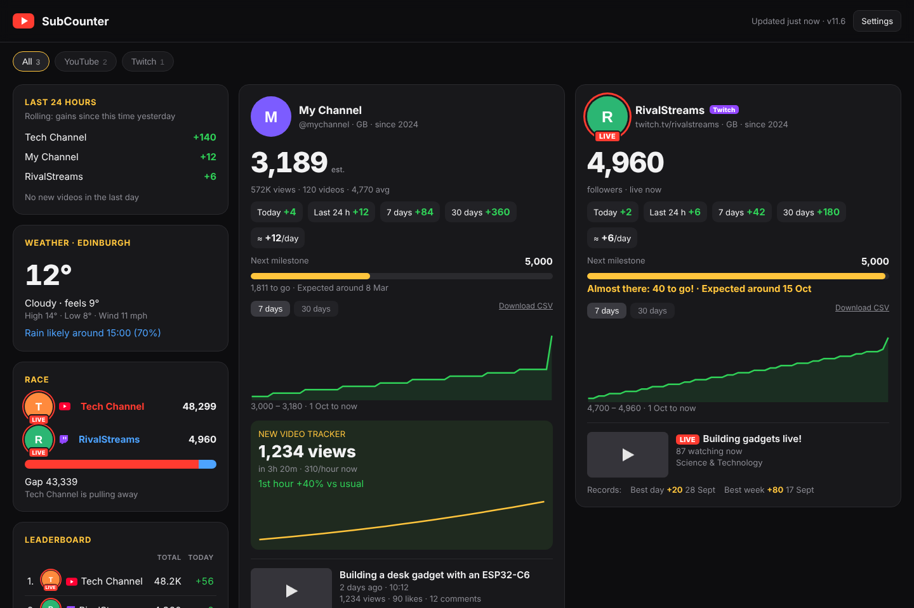

# SubCounter

A desk gadget built on the **Waveshare ESP32-C6-Touch-LCD-1.47** that shows live YouTube subscriber counts, and has grown into a small desk hub: YouTube stats, weather, Spotify, a web dashboard, motion gestures and more.



## What's new

- **v9.5:** open the dashboard at `http://subcounter.local`; IP address shown on start-up and on the home menu
- **v9.4:** redesigned web dashboard: a side column (last 24 hours, weather, race, leaderboard) next to a grid of channel cards, laid out for desktop, tablet and phone
- **v9.3:** idle clock after a few minutes without use
- **v9.2:** scrolling Spotify titles and artist names
- **v9.1:** one-click Spotify sign-in through an https relay page

Full history: [docs/CHANGELOG.md](docs/CHANGELOG.md)

## Features

**YouTube**
- Track up to 10 channels: swipe left and right between them on the touch screen
- Swipe up for detail cards: Overview (profile picture, views, videos), Latest video (with a LIVE badge), Growth (today / 7 / 30 days), a 7-day graph and Next milestone (with a predicted date)
- Swipe down for the Leaderboard, then the Subscriber race (two channels head to head, with an "OVERTAKE!" alert)
- Alerts for new subscribers, with confetti for milestones (bigger milestone, bigger party)
- Estimated live counts between YouTube's rounded steps (marked "est.")
- **New video tracker** for your own channel: views per hour for 48 hours, compared with your usual uploads, plus view milestone alerts
- Subscriber history saved on the board, so graphs survive restarts

**Apps** (long-press the screen for the home menu)
- **Weather:** clock, current conditions, next 12 hours, tomorrow, and a rain warning (Open-Meteo, no key needed)
- **Spotify:** album art, scrolling title and artist, progress bar; tap to play or pause, swipe to skip, swipe up or down for volume. One-click sign-in from the settings page (via a small relay page you host on GitHub Pages)

**Motion sensor**
- Shake to refresh · face-down turns the screen off · stand it in portrait for a tall leaderboard · double-tap the desk for the next channel

**Web dashboard** (`http://subcounter.local` or `http://<board-ip>/` from any phone or computer on your network)
- Side column with the last 24 hours' top growers, weather, the race and the leaderboard
- A card per channel: live (estimated) count, growth chips, milestone progress and predicted date, 7 or 30-day graph, latest video with thumbnail, and the new video tracker on your own channel
- Adapts to the screen: side column on desktops, two columns on tablets, one on phones
- Settings at `/settings` and wireless updates at `/update`

**Everyday**
- **Idle clock:** after 3 minutes without use (adjustable), a large clock with date, weather and your count; pick the board up to go back
- 9 am daily summary, plus a dim night clock overnight
- Several saved Wi-Fi networks (e.g. work and home) with automatic roaming, a network scanner, "Connect now" and a preferred network
- Works on fussy networks: fixed IP, custom DNS, Wi-Fi 4 compatibility mode, and plain-English connection errors
- **Wireless firmware updates** from the settings page

## Quick start

1. **Flash the board.** Open <https://espressif.github.io/esptool-js/> in Chrome, connect the board, and flash `builds/latest/SubCounter-v9.5-FULL-new-board-flash-at-0x0.bin` at address **0x0**.
2. **Set it up.** The board shows *SETUP MODE*. Join the Wi-Fi network **SubCounter-Setup** from your phone, and the setup page opens by itself (or go to <http://192.168.4.1>). Pick your Wi-Fi, add your YouTube channels and a YouTube Data API key, then save.
3. **Use it.** The board shows its address for a few seconds, then your subscriber count. Open **<http://subcounter.local>** (or the IP address) in a browser for the dashboard.

Full instructions: **[docs/GETTING-STARTED.md](docs/GETTING-STARTED.md)**

## Documentation

| Guide | What's in it |
|---|---|
| [Getting started](docs/GETTING-STARTED.md) | Flashing, first setup, getting a YouTube API key |
| [Using SubCounter](docs/USING.md) | Gestures, cards, apps, dashboard, alerts |
| [Wi-Fi & networks](docs/WIFI.md) | Multiple networks, fixed IP, iPhone hotspot, error messages |
| [Spotify setup](docs/SPOTIFY.md) | Developer app, GitHub Pages relay, connecting |
| [Updating & flash layout](docs/UPDATING.md) | Wireless updates, which file goes at which address |
| [Building from source](docs/BUILDING.md) | Arduino IDE settings and libraries |
| [Changelog](docs/CHANGELOG.md) | What changed in each version |

## Repository layout

```
firmware/SubCounter/     main firmware source (Arduino sketch)
firmware/FirstSketch/    first hello-world / test sketch
builds/latest/           ready-to-flash files for the current version
builds/archive/          every earlier build
spotify-callback/        relay page for Spotify sign-in (host on GitHub Pages)
docs/                    guides and screenshots
```

## Hardware

- Waveshare **ESP32-C6-Touch-LCD-1.47**: ESP32-C6, 8 MB flash, 1.47" 172×320 touch LCD (JD9853 + AXS5106L), QMI8658 motion sensor
- USB-C cable (a data cable, not a charge-only one)

## Credits

Pin mapping and the panel start-up sequence for this board come from
[andreimagic/ESP32_C6_Touch_LCD_1_47_LVGL_Animated_Clock](https://github.com/andreimagic/ESP32_C6_Touch_LCD_1_47_LVGL_Animated_Clock) (MIT). See [THIRD-PARTY-NOTICES.md](THIRD-PARTY-NOTICES.md).
