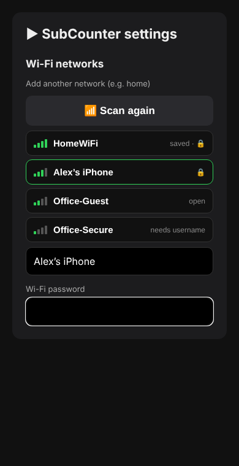

# Getting started

## What you need

- A Waveshare **ESP32-C6-Touch-LCD-1.47** board and a USB-C **data** cable
- Google Chrome (or Edge) on a computer, for flashing over USB
- A **YouTube Data API key** (free, see below)
- A 2.4 GHz Wi-Fi network (the board can't use 5 GHz)

## 1. Flash the firmware

1. Plug the board into your computer.
2. Open **<https://espressif.github.io/esptool-js/>** in Chrome.
3. Click **Connect** and pick the board (it shows up as *USB JTAG/serial debug unit*).
4. Set **Flash Address** to **`0x0`** and choose
   `builds/latest/SubCounter-v11.9-FULL-new-board-flash-at-0x0.bin`.
5. Click **Program**. When it finishes, press **RESET** on the board.

> If it won't connect: hold **BOOT**, tap **RESET**, release **BOOT**, then try again.
> On a Mac, no driver is needed: the ESP32-C6 has USB built in.

The FULL file is only for a new or wiped board. To update a board that's already set up, see [UPDATING.md](UPDATING.md).

## 2. Get a YouTube Data API key

1. Go to <https://console.cloud.google.com/> and create a project (any name).
2. **APIs & Services → Library** → search **YouTube Data API v3** → **Enable**.
3. **APIs & Services → Credentials** → **Create credentials → API key**.
4. Optional but sensible: **Edit the key → API restrictions → Restrict key → YouTube Data API v3**. Leave *Application restrictions* on **None**.

The free quota is 10,000 units a day; SubCounter uses roughly 3,000–3,500 with 10 YouTube channels.

## 3. First setup

1. After flashing, the board shows **SETUP MODE**.
2. On your phone or computer, join the Wi-Fi network **SubCounter-Setup**.
3. The setup page should pop up by itself. If not, open **<http://192.168.4.1>**.
4. Fill in:
   - **YouTube** section → **YouTube channels:** one per line. `@handles`, `UC…` channel IDs or pasted channel links all work. **Put your own channel first**: it gets highlighted, shown on the night clock, and gets the new video tracker.
   - **YouTube Data API key**
   - **Twitch** section (optional) → Twitch channel names, one per line. These need a free Twitch app: see [TWITCH.md](TWITCH.md). If you only follow Twitch channels, you can skip the YouTube key.
   - **Wi-Fi networks** section → tap **Scan for networks**, choose yours, and enter the password.

   Everything else can be changed later. The links at the top of the page jump to each section.

   
5. Press **Save & restart**.

The board joins your Wi-Fi and shows a **QR code** with its address for a few seconds, then your subscriber count. Scan the code with your phone's camera, or open **<http://subcounter.local>** in a browser, for the dashboard. If `.local` doesn't work (some Android phones), use the IP address shown next to the QR code. You can bring the QR screen back any time: long-press → swipe left → **Device**. Tip: set a DHCP reservation for **subcounter** in your router so the IP never changes.

## 4. Optional extras

- **Weather:** Settings → *Weather* → your town (default Glasgow)
- **Colour theme and brightness:** Settings → *Display*
- **Phone notifications** (milestones, going live, records): Settings → *Phone notifications*, see [USING.md](USING.md#phone-notifications)
- **Settings PIN:** Settings → *Security*, see [USING.md](USING.md#settings-pin)
- **Automatic updates:** Settings → *Updates*
- **Twitch channels:** see [TWITCH.md](TWITCH.md)
- **Spotify:** see [SPOTIFY.md](SPOTIFY.md)
- **Motion calibration:** put the board where it normally sits, then Settings → *Motion* → *Set this as the normal position*
- **More Wi-Fi networks** (home, work, phone hotspot): see [WIFI.md](WIFI.md)

## Getting back into setup

Hold the **BOOT** button for **3 seconds** at any time to open setup mode. Your saved settings are kept, so you only change what you need. (Holding it for about **1 second** opens the home menu instead.)
